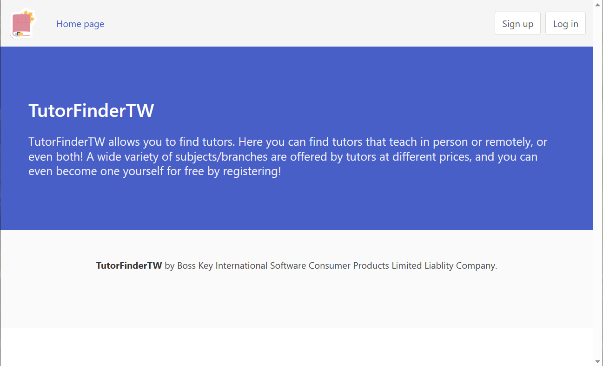
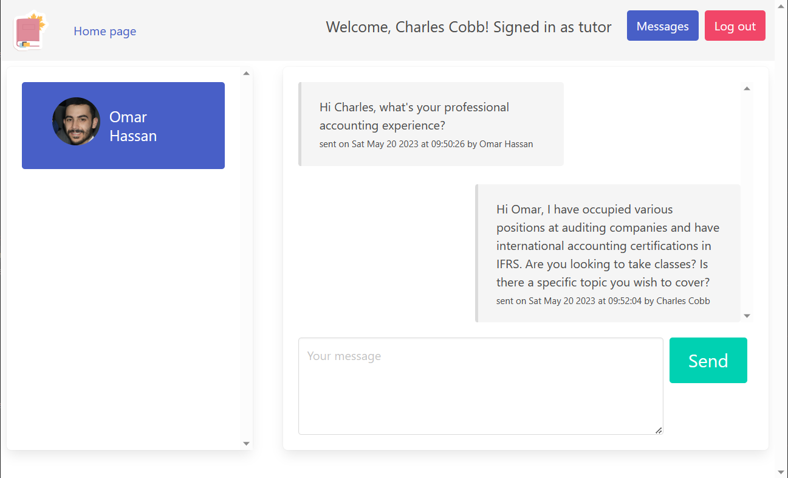

# TutorFinder

A place to connect tutors and students.

App features:
* Clean and responsive user interface based on Bulma CSS framework
* Different user journeys with focus on the students - the tutors do not have access to the catalogue
* Chats between students and tutors
* Stateless authentication based on [`jsonwebtoken`](https://www.npmjs.com/package/jsonwebtoken)
* Simple "in-house" image handling and storage

<div style="display: flex; flex-direction: row; align-items: start; flex-wrap: wrap; gap: 5px">




</div>
<br>

# Getting started

Make sure you have Node.js installed or install it. Install the dependencies by running `npm install` command in the `server` and `client` directories. 

To start a local development server:
1. create a `.env` file in `server/src` directory and populate it with `PORT` and `SECRET` variables:

```TypeScript
PORT=8080
SECRET="YOUR SECRET KEY"
```
2. run `nodemon index.ts` command from `server/src` directory

To start the frontend server run `npm start` command from the top of the `client` directory.

By default, the frontend connects to `http://localhost:8080`. If you wish to use a different port, edit the `env.ts` file in `client/src` directory.

In the `mocks` directory you will find a `json` file with four user profiles: one student and three tutors. You can start the app and load this file into your MongoDB and copy the `uploads` directory into `server/src` directory to display images for these profiles. `Password1` is the password for all the mock profiles.

# Tech stack

TypeScript on the frontend and the backend

## Front end

React, Bulma CSS framework

## Backend

Node.js server (Express), [`jsonwebtoken`](https://www.npmjs.com/package/jsonwebtoken) and [`bcrypt`](https://www.npmjs.com/package/bcrypt) for authentication, [`multer`](https://www.npmjs.com/package/multer) for form data handling, MongoDB with Mongoose ORM library

# Contributors

This is a fork of [Aaron Sherill](https://github.com/sherrilla71940)'s [project](https://github.com/sherrilla71940/TutorFinderTW). Developed by [Anton Novak](https://github.com/anton-novak) and [Danny Gold](https://github.com/dgold01).